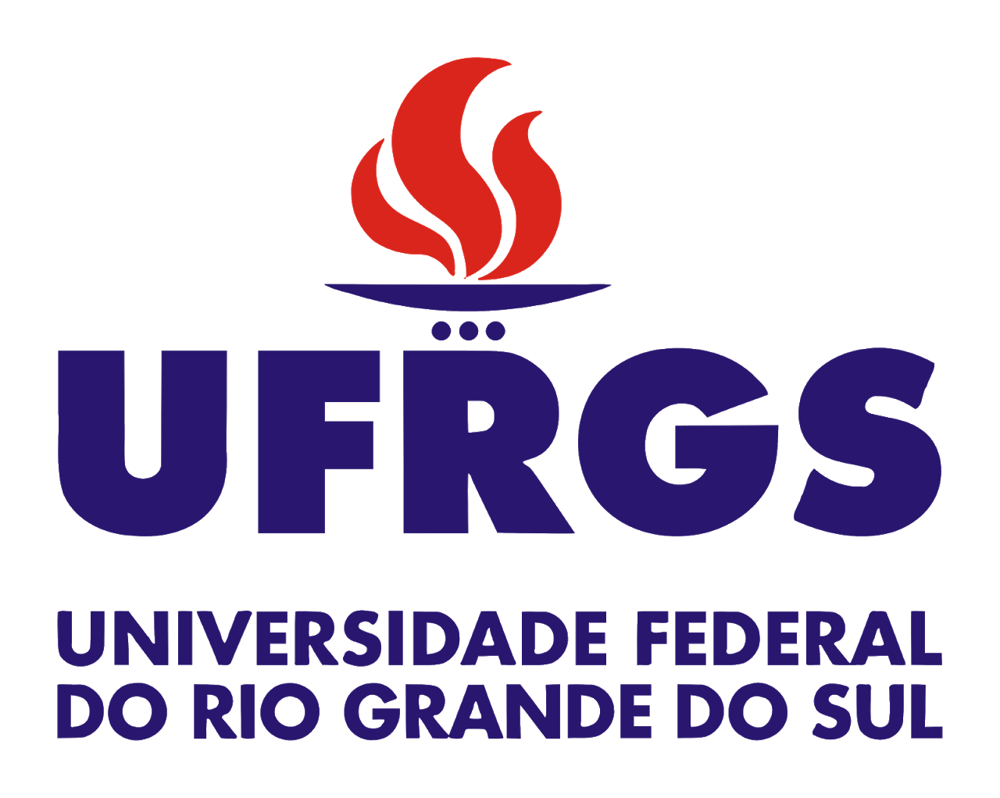

Esta é uma inciativa independente de pesquisadores, que congrega uma equipe multidisciplinar (matemática, engenharias, computação, arquitetura, jornalismo), para responder algumas demandas emergentes com o avanço da pandemia de COVID-19 em âmbito nacional, com ênfase no Estado do Rio de Janeiro. O interesse individual dos membros da equipe pela pandemia levou, naturalmente, ao intercâmbio de informações entre pesquisadores e estudantes, tais como fontes de dados, análises gráficas, notícias, relatórios e artigos científicos e, especialmente, ferramentas matemáticas empregadas na modelagem e análise do progresso de epidemias. Essa interação resultou na organização de uma força tarefa para buscar algumas soluções em termos de análise e visualização de dados, modelagem matemática da epidemia, bem como para produzir material educacional para estudantes interessados no tema e para o público em geral.

Dessa forma, os objetivos da presente iniciativa se articulam em tornos dos seguintes tópicos:
- Monitorar, em âmbito nacional e no estado do Rio de Janeiro, o progresso da pandemia de COVID-19;
- Construir gráficos e outras entidades para visualização de dados que permitam acompanhar e analisar o progresso da pandemia de modo claro e pedagógico;
- Fazer previsões confiáveis sobre o progresso de curto prazo da pandemia (número de infectados, número de óbitos, variações dos mesmos etc);
- Desenvolver material educativo de alto nível na área de modelagem matemática de epidemias;
- Desenvolver e divulgar material informativo de qualidade para o público interessado.

Nossas análises são divulgadas nos seguintes canais:
- www.covid19rj.org
- www.instagram.com/portalcovid19rj
- www.facebook.com/portalcovid19rj
- www.twitter.com/portalcovid19rj

## Equipe

Professores:
- Adriano Côrtes
- Americo Cunha
- Karla Figueiredo
- Lisandro Lovisolo
- Malú Grave
- Rodrigo Burgos
- Roberto Velho

Estudantes:
- Bruna Pavlack
- Diego Catalão
- Diego Matos
- Eber Dantas
- João Pedro Norenberg
- Julio Basilio
- Leonardo de la Roca
- Luiz Felipe Coelho
- Lucas Chaves
- Marcos Vinicius Issa
- Michel Tosin
- Roberto Luo

Design Gráfico:
- Amanda Cunha Guyt

Comunicação:
- Luthiana Soares

## Instituições dos pesquisadores participantes

      

## Como citar esses repositório?

```
@misc{COVID19RJGitHub,
   title        = {{COVID19}: {O}bserva\'{o}rio {F}luminense},
   year         = {2020},
   publisher    = {GitHub},
   journal      = {GitHub repository},
   howpublished = {\url{https://americocunhajr.github.io/COVID19RJ}},
}
```
