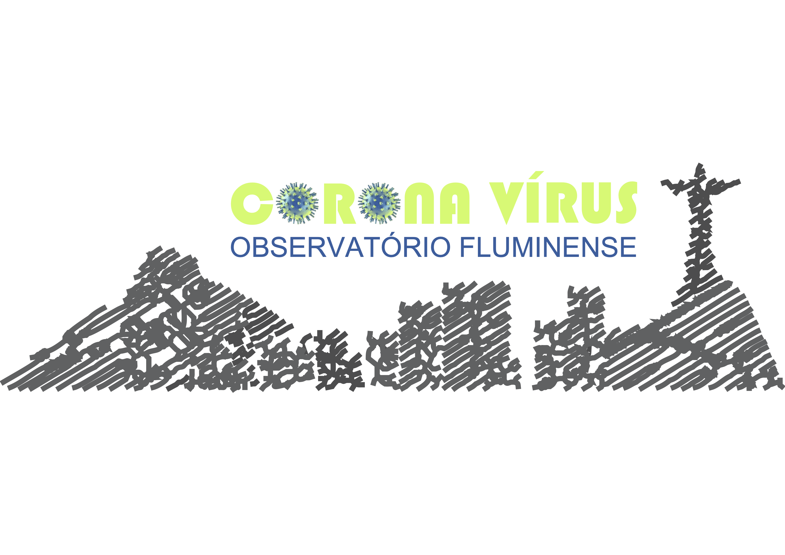

Esse repositório reune informações e dados da epidemia de COVID-19, com particular interesse em catalogar informações relativas ao progresso dessa doença no Estado do Rio de Janeiro.

## Links Relevantes:
###### * OBS: Para abrir um link em uma nova aba, simplesmente clique enquanto pressiona a tecla “Ctrl” no teclado.

| Orgãos governamentais e ONGs |
| :----- |
|[Ministério da Saúde do Brasil](https://saude.gov.br/)|
|[World Health Organization (WHO)](https://www.who.int/emergencies/diseases/novel-coronavirus-2019)|
|[U.S. Centers for Disease Control and Prevention (CDC)](https://www.cdc.gov/coronavirus/2019-ncov/index.html)| 
|[U.S. National Institutes of Health (NIH)](https://www.fic.nih.gov/ResearchTopics/Pages/infectiousdiseases-coronavirus-cov.aspx)| 
|[European Centre for Disease Prevention and Control (ECDC)]( https://www.ecdc.europa.eu/en/covid-19-pandemic)|

| Páginas de informações fornecidas por outras organizações e sociedades |
| :----- |
|[American Society for Microbiology](https://asm.org/Press-Releases/2020/COVID-19-Resources)|
|[Federation of American Scientists (FAS)](https://fas.org/ncov/)|
|[Models of Infectious Disease Agent Study (MIDAS) Network](https://midasnetwork.us/covid-19/)|
|[Models of Infectious Disease Agent Study (MIDAS) GitHub](https://github.com/midas-network/COVID-19)| 
|[Research Amer!ca](https://www.researchamerica.org/covid19)|
|[Society for Industrial and Applied Mathematics (SIAM) Epidemiology Collection](https://epubs.siam.org/page/EpidemiologyCollection)
|[International Council for Industrial and Applied Mathematics (ICIAM)](http://www.iciam.org/mathematics-covid-19)|
|[Fighting COVID-19 By Bringing Together Researchers Across Disciplines](https://covid19.researcher.life/)|

| Monitoramento |
| :----- |
|[COVID-19 Dashboard by the Center for Systems Science and Engineering (CSSE) at Johns Hopkins University (JHU)](https://coronavirus.jhu.edu/map.html)|
|[COVID-19 World Health Organization (WHO)](https://covid19.who.int/)|
|[Brasil por Estado USP](https://ciis.fmrp.usp.br/covid19/estado-br/)|
|[Worldometer](https://www.worldometers.info/coronavirus/)|
|[U.S. Health Weather Map](https://healthweather.us/)|
|[Databrew's COVID-19 epidemic curve explorer](https://datacat.cc/covid/)|
|[Mortes por coronavírus no Brasil](https://especiais.g1.globo.com/bemestar/coronavirus/mapa-coronavirus/#/)|

| Dados |
| :----- |
|[Interactive dashboard to track COVID-19 (Johns Hopkins University)](https://systems.jhu.edu/research/public-health/ncov/)|
|[Novel Coronavirus (COVID-19) Cases, provided by JHU CSSE](https://github.com/CSSEGISandData)|
|[Download de dados de COVID-19 no Brasil](https://liibre.github.io/coronabr/)|
|[Observatório COVID-19](https://covid19br.github.io/)|
|[Institute for Health Metrics and Evaluation (IHME) COVID-19 GitHub](https://github.com/ihmeuw-msca/CurveFit)|
|[Our World in Data](https://ourworldindata.org/coronavirus)|
|[Coronavirus Source Data (CSV or XLSX)](https://ourworldindata.org/coronavirus-source-data)|
|[Data-Driven Estimation of End Dates](https://ddi.sutd.edu.sg/)|
|[Portal da transparência COVID-19](https://transparencia.registrocivil.org.br/especial-covid)|
|[Número de casos confirmados de COVID-19 no Brasil](https://github.com/wcota/covid19br)|
|[COVID-19 Analytics PUC-Rio](https://covid19analytics.com.br/)|

| Modelagens |
| :----- |
|[A Matemática da Covid-19](http://covid19.mat.br/)|
|[Data-driven prediction of infection by the SIR model (Work in progress!)](https://cse-lab.ethz.ch/coronavirus/)|
|[Epidemic Calculator](https://gabgoh.github.io/COVID/index.html)|
|[COVID-19 Scenarios](https://covid19-scenarios.org/)|
|[Interactive charts the new confirmed cases of COVID-19](https://aatishb.com/covidtrends/)|
|[Institute for Health Metrics and Evaluation (IHME) (University of Washington)](http://www.healthdata.org/covid)|
|[Modelagem matemática do COVID-19 em Brasil](https://cic.unb.br/~lucero/covid_pt.html)|
|[Modelo de Dispersão do Coronavírus](https://simulacovid.github.io/covid19/index.html)|
|[SIR (Susceptible, Infected and Recovered) code in python to model the spread of COVID-19](https://github.com/wlyra/covid19)|

| Artigos sobre Coronavírus e Epidemiologia |
| :----- |
|[A collection of epidemiology articles in SIAM journals, made free as a public service](https://epubs.siam.org/page/EpidemiologyCollection)|
|[Centre for Mathematical of Modelling of Infectious Diseases (CCMID) Repository](https://cmmid.github.io/topics/covid19/)|
|[Articles and updates published by Imperial College COVID-19 Response Team](https://www.imperial.ac.uk/mrc-global-infectious-disease-analysis/covid-19/covid-19-information/)|
|[Article using simulations to demonstrate “flattening the curve” (Harry Stevens, Washington Post)]( https://www.washingtonpost.com/graphics/2020/world/corona-simulator/)|
|[The effect of summer on SARS-CoV-2 (Marc Lipsitch, Harvard School of Public Health)](https://ccdd.hsph.harvard.edu/will-covid-19-go-away-on-its-own-in-warmer-weather/)|
|[The dynamics of COVID-19 under social distancing (Ezekiel Emanuel et al., University of Pennsylvania in New York Times op-ed)](https://www.nytimes.com/2020/03/17/opinion/coronavirus-social-distancing-effect.html)|
|[U.S. National Institutes of Health (NIH)](https://www.fic.nih.gov/ResearchTopics/Pages/infectiousdiseases-coronavirus-cov.aspx)|
|[Why is it difficult to accurately predict the COVID-19 epidemic?](https://www.ncbi.nlm.nih.gov/pmc/articles/PMC7104073/)|
|[AWS makes COVID-19 datasets freely available](https://www.infoworld.com/article/3537593/aws-makes-covid-19-datasets-freely-available.html)|
|[How does the coronavirus work?](https://www.technologyreview.com/2020/04/15/999476/explainer-how-does-the-coronavirus-work/?utm_medium=tr_social&utm_campaign=site_visitor.unpaid.engagement&utm_source=Facebook#Echobox=1587155881)|
|[COVID-19 and hospitalizations for SARI in Brazil: a comparison up to the 12th epidemiological week of 2020](https://www.scielosp.org/article/csp/2020.v36n4/e00070120/en/)
|[Coronavírus: Por que o isolamento por idade não funciona](https://medium.com/@wlyra/coronav%C3%ADrus-porque-o-isolamento-por-idade-n%C3%A3o-funciona-898d0a4a0d5b)|
|[COVID-19 pandemics modeling with SEIR(+CAQH), social distancing, and age stratification. The effect of vertical confinement and release in Brazil.](https://www.medrxiv.org/content/10.1101/2020.04.09.20060053v3)|
|[Short-Term Covid-19 Forecast for Latecomers](https://www.dropbox.com/s/z3nqral0u26b50u/Short_term_COVID19_forecast%20V1.pdf?dl=0)|
|[Your Sacrifices are Saving Lives](https://medium.com/@inders/your-sacrifices-are-saving-lives-3c80d88cea39)|
|[Expected impact of COVID-19 outbreak in a major metropolitan area in Brazil](https://www.medrxiv.org/content/10.1101/2020.03.14.20035873v1)|
|[A contribution to the mathematical theory of epidemics](https://royalsocietypublishing.org/doi/10.1098/rspa.1927.0118)|
|[Modelling Global Outbreaks and Proliferation of COVID-19](https://sinews.siam.org/Details-Page/modelling-global-outbreaks-and-proliferation-of-covid-19)|
|[A Model to Predict COVID-19 Epidemics with Applications to South Korea, Italy, and Spain](https://sinews.siam.org/Details-Page/a-model-to-predict-covid-19-epidemics-with-applications-to-south-korea-italy-and-spain)|
|[Choosing Intervention Strategies During an Emerging Epidemic](https://sinews.siam.org/Details-Page/choosing-intervention-strategies-during-an-emerging-epidemic)|
|[The Forensics of Emerging Diseases](https://sinews.siam.org/Details-Page/the-forensics-of-emerging-diseases)|
|[Modeling the Spread of COVID-19](https://sinews.siam.org/Details-Page/modeling-the-spread-of-covid-19)|

| Solicitações de financimento COVID-19 |
| :----- |
|[Elrha](https://www.elrha.org/funding-opportunity/research-to-support-covid-19-response-in-humanitarian-settings/)|
|[U.S. National Institutes of Health (NIH)](https://grants.nih.gov/grants/natural_disasters/corona-virus.htm)|
|[U.S. National Institute of Allergy and Infectious Diseases (NIAID)](https://www.niaid.nih.gov/grants-contracts/response-covid-2019-outbreak)| 
|[U.S National Science Foundation (NSF)](https://www.nsf.gov/news/special_reports/coronavirus/)|
|[U.K Wellcome Trust](https://wellcome.ac.uk/grant-funding/schemes/epidemic-preparedness-covid-19)|

## Vídeos educativos:

### Americo Cunha Jr
  - [Xadrez, Feijão e COVID-19: Um Perigo Exponencial](https://www.youtube.com/watch?v=2-7WrBDdp30)
  - [O que simulações computacionais podem (ou não) dizer sobre a pandemia?](https://www.youtube.com/watch?v=ZjfpZSQF_vM&t=156s)

### 3Blue1Brown
  - [Simulando uma epidemia](https://m.youtube.com/watch?v=gxAaO2rsdIs)
 
 ### Flávio Codeço Coelho
  - [Ferramentas para pensar a Pandemia: o Nosso dashboard](https://www.youtube.com/watch?v=C5K5YVaWmNo&feature=youtu.be)

## Equipe:

Professores:
- Adriano Cortês
- Americo Cunha
- Karla Figueiredo
- Lisandro Lovisolo
- Rodrigo Burgos

Estudantes:
- Bruna Pavlack
- Diego Matos
- Eber Dantas
- Julio Basilio
- Leonardo de la Roca
- Lucas Chaves
- Marcos Vinicius Issa
- Michel Tosin
- Roberto Luo

Design Gráfico:
Amanda Cunha

## Instituições Participantes:

     
